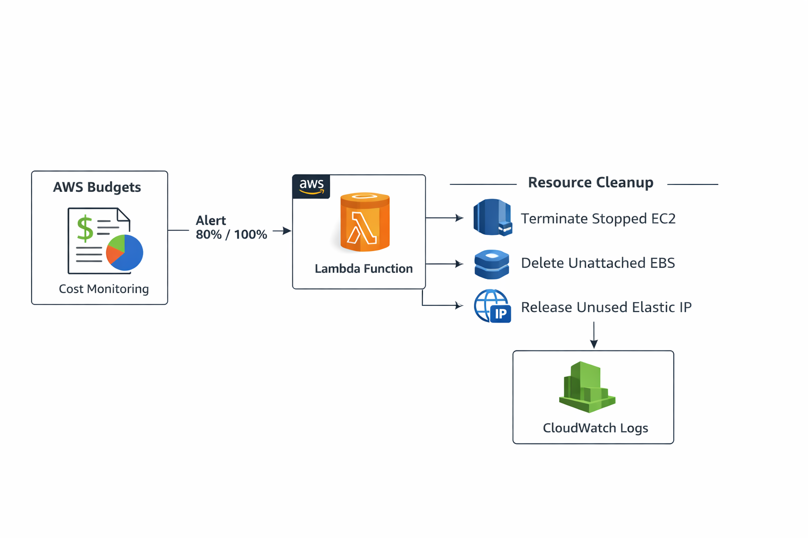
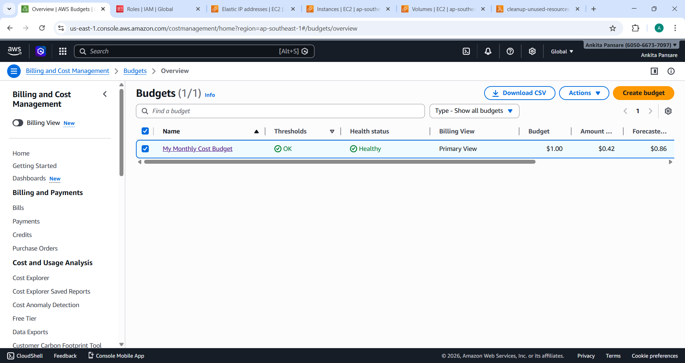
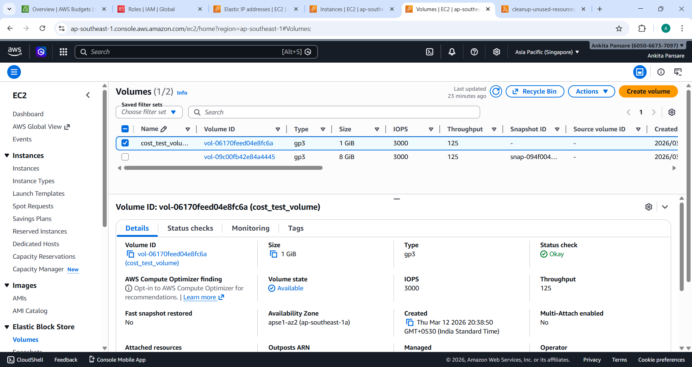
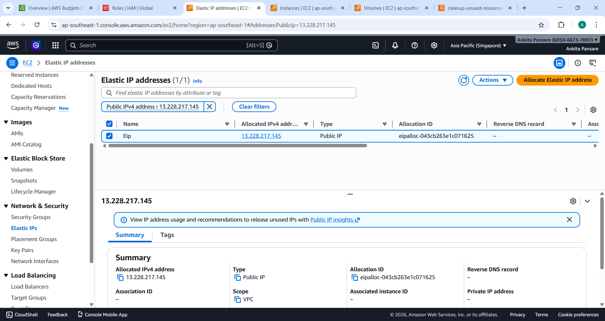
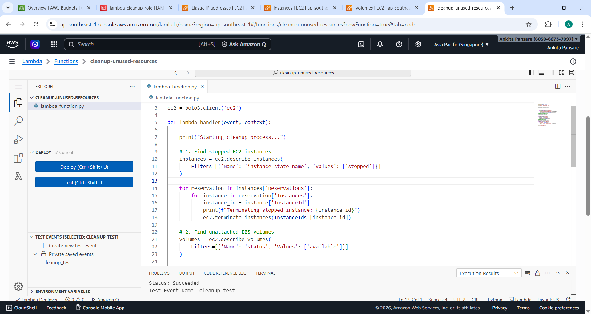
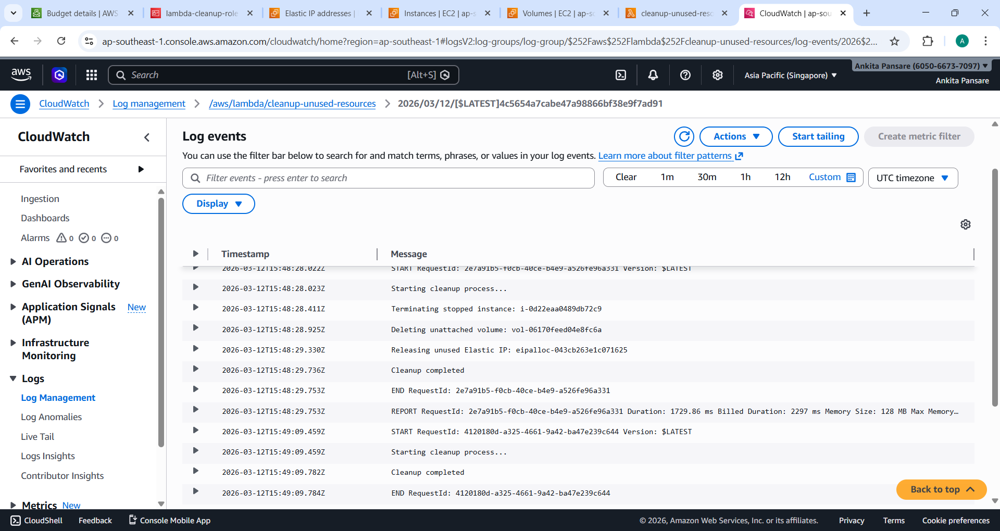

# AWS Cost Optimization and Resource Governance

## Project Overview
This project demonstrates how to implement a cost optimization and resource governance mechanism in AWS. The system monitors AWS spending using AWS Budgets and automatically cleans up unused resources such as stopped EC2 instances, unattached EBS volumes, and unused Elastic IP addresses using AWS Lambda.

The main objective is to reduce unnecessary AWS costs by identifying idle resources and automating the cleanup process.

---

## Problem Statement
Organizations often experience increasing AWS bills due to unused resources such as:

- Stopped EC2 instances
- Unattached EBS volumes
- Unused Elastic IP addresses

To solve this problem, this project implements a cost monitoring and automated cleanup system using AWS services.

---

## AWS Services Used

- AWS Budgets
- Amazon EC2
- Amazon EBS
- Elastic IP
- AWS Lambda
- Amazon CloudWatch
- AWS IAM

---

## Architecture Diagram

AWS Budgets monitors cost usage in the AWS account.  
A Lambda function scans the environment and identifies unused resources such as stopped EC2 instances, unattached EBS volumes, and unused Elastic IP addresses.  
The Lambda function automatically performs cleanup actions to optimize cost.  
All actions are logged in CloudWatch for monitoring.

---

## Implementation Steps

### Step 1: Configure AWS Budget
1. Open AWS Management Console.
2. Navigate to AWS Budgets.
3. Create a new cost budget.
4. Set monthly budget limit (example: $1).
5. Configure email alerts at 80% and 100%.
6. Save the budget configuration.

---

### Step 2: Launch EC2 Instance
1. Open Amazon EC2 dashboard.
2. Click Launch Instance.
3. Select Amazon Linux AMI.
4. Choose instance type t2.micro.
5. Launch the instance.
6. Stop the instance to simulate an unused resource.

---

### Step 3: Create Unattached EBS Volume
1. Go to EC2 Dashboard.
2. Navigate to Volumes.
3. Click Create Volume.
4. Create a volume without attaching it to any instance.

---

### Step 4: Allocate Elastic IP
1. Go to EC2 Dashboard.
2. Open Elastic IP section.
3. Allocate a new Elastic IP.
4. Do not associate the IP with any instance.

---

### Step 5: Create IAM Role
1. Open AWS IAM service.
2. Create a role for Lambda.
3. Attach permissions to manage EC2 resources.
4. Assign this role to Lambda.

---

### Step 6: Create Lambda Function
1. Open AWS Lambda service.
2. Click Create Function.
3. Choose Author from Scratch.
4. Provide function name: cleanup-unused-resources.
5. Select Python runtime.
6. Attach the IAM role.

---

### Step 7: Add Automation Code
Add Python code inside the Lambda function to:

- Detect stopped EC2 instances
- Delete unattached EBS volumes
- Release unused Elastic IP addresses

Deploy the Lambda function.

---

### Step 8: Test the Lambda Function
1. Create a test event.
2. Run the Lambda function.
3. The function detects and removes unused resources.

---

### Step 9: Monitor Logs
Open CloudWatch logs from the Lambda Monitor tab and verify the cleanup actions.

Example logs:

Starting cleanup process  
Terminating stopped instance  
Deleting unattached volume  
Releasing unused Elastic IP  
Cleanup completed  

---

## Screenshots

### Budget Configuration

### EC2 Instance

### EBS Volume

### Elastic IP

### Lambda Function

### CloudWatch Logs

---

## Cost Optimization Strategy

This project reduces AWS costs by implementing:

- Budget monitoring and alerts
- Automated detection of idle resources
- Automatic cleanup using serverless automation
- Centralized logging and monitoring

---

## Governance Approach

The project follows a governance approach where:

- Budgets monitor cloud spending
- Automation prevents resource waste
- Logging ensures transparency and monitoring

---
